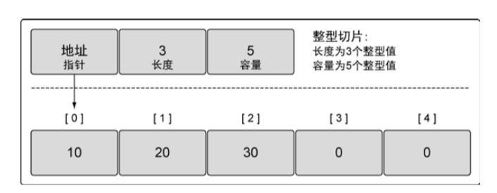
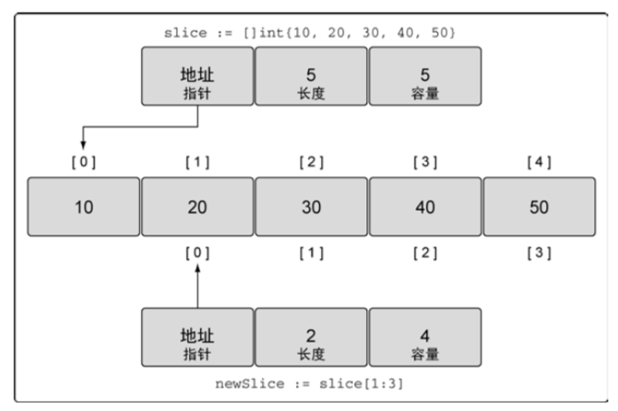
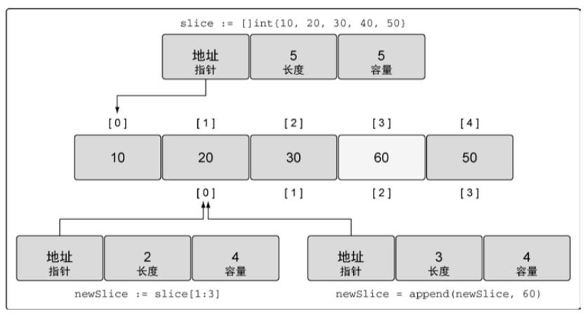
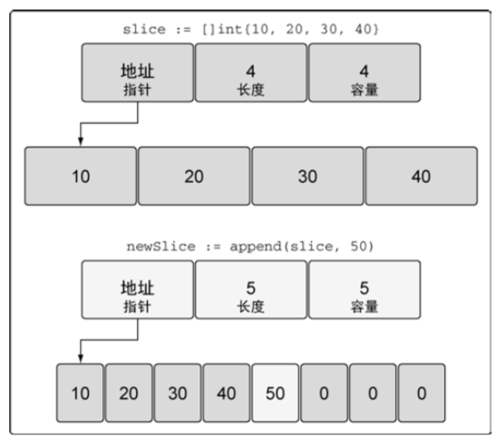
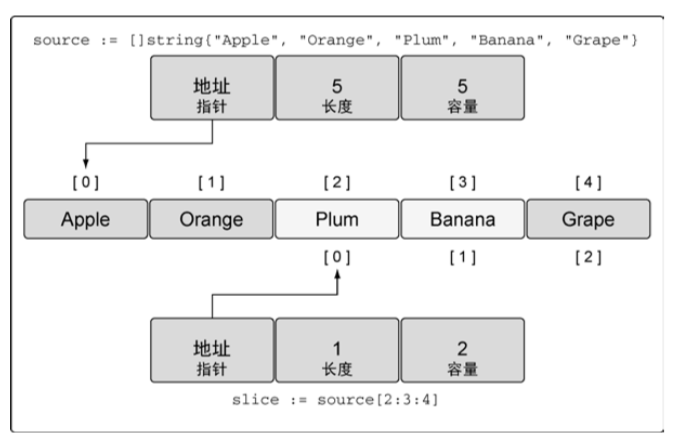
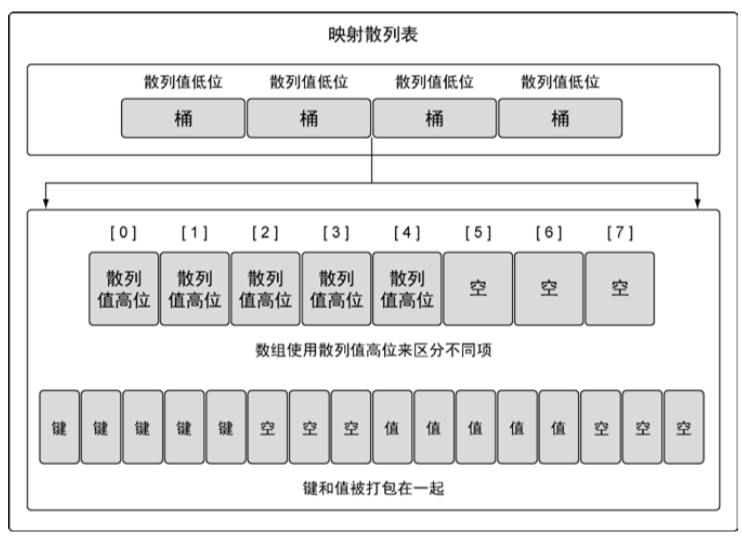

# Chapter4

## Array
声明数组时需要指定内部存储的数据的类型，以及需要存储的元素的数量，这个数量也称为数组的长度。

### 声明和初始化
```go
var array1 [5]int
array2 := [5]int{10, 20, 30, 40, 50}
array3 := [...]int{10, 20, 30, 40, 50}
array4 := [5]int{1: 10, 2: 20}
```

### 使用数组
要访问数组里某个单独元素，使用`[]`运算符。如
```go
array := [5]int{10, 20, 30, 40, 50}
fmt.Println(array[2]) // 输出 30
```

数组变量的类型包括数组长度和每个元素的类型。只有这两部分都相同的数组，才是类型相同的数组，才能互相赋值。

### 多维数组
```go
var array1 [4][2]int
array2 := [4][2]int{{10, 11}, {20, 21}, {30, 31}, {40, 41}}
array3 := [4][2]int{1: {20, 21}, 3: {40, 41}}
array4 := [4][2]int{1: {0: 20}, 3: {1: 41}}
fmt.Println(array2[0][0]) // 输出 10
```

### 数组参数
根据内存和性能来看，在函数间传递数组是一个开销很大的操作。在函数之间传递变量时， 总是以值的方式传递的。
如果这个变量是一个数组，意味着整个数组，不管有多长，都会完整复制，并传递给函数。

更有效的方式是传入指向数组的指针

```go
var array [1e6]int

func foo1(array [1e6]int){
}

func foo2(array *[1e6]int){
}

foo1(array)
foo2(&array)
```

## Slice
切片是一种数据结构，这种数据结构便于使用和管理数据集合。切片是围绕动态数组的概念构建的，可以按需自动增长和缩小。
切片的动态增长是通过内置函数 append 来实现的。这个函数可以快速且高效地增长切片。
还可以通过对切片再次切片来缩小一个切片的大小。因为切片的底层内存也是在连续块中分配的，
所以切片还能获得索引、迭代以及为垃圾回收优化的好处。

切片有 3 个字段的数据结构，这些数据结构包含 Go 语言需要操作底层数组的元数据。
这 3 个字段分别是指向底层数组的指针、切片访问的元素的个数(即长度)和切片允许增长到的元素个数(即容量)。



### 切片创建和初始化
```go
slice1 := make([]string, 5) // 声明一个长度和容量都是 5 的字符串切片

slice2 := make([]int, 3, 5) // 声明一个长度是 3，容量是 5 的整型切片

slice3 := []string{"Red", "Blue", "Green", "Yellow", "Pink"} // 声明一个长度和容量都是 5 的字符串切片
slice4 := []string{99: ""} // 声明一个长度和容量都是 100 的字符串切片，使用空字符串初始化
var slice5 []int // nil 整型切片
slice6 := make([]int, 0) // 使用 make 创建空的整型切片
slice7 := []int{} // 使用切片字面量创建空的整型切片
slice8 := slice3[2:3:4] // 创建长度为 1 个元素，容量为 2 个元素的切片

```

如果这个切片创建新的切片，新切片会和原有切片共享底层数组，也能通过后期操作来访问多余容量的元素。

**不允许创建容量小于长度的切片**
```go
slice := make([]int, 5, 3) // 会导致运行时错误
```

### 使用切片
```go
slice := []int{10, 20, 30, 40, 50}
slice[1] = 25 // 改变索引为 1 的元素值
```

#### 使用切片创建切片
```go
slice := []int{10, 20, 30, 40, 50} // slice 其长度为 5 个元素，容量为 5 个元素
newSlice := slice[1:3] // newSlice 其长度为 2 个元素，容量为 4 个元素
```
对底层数组容量是 k 的切片 `slice[i:j]`来说：

长度: j - i

容量: k - i

上述代码中的 `slice` 和 `newSlice` 低层数据结构如下图：



**需要记住的是，现在两个切片共享同一个底层数组。如果一个切片修改了该底层数组的共享部分，另一个切片也能感知到**

**切片只能访问到其长度内的元素。试图访问超出其长度的元素将会导致语言运行时异常**

#### 切片增长 append
切片增长使用 append，当 append 调用返回时，会返回一个包含修改结果的新切片。
函数 append 总是会增加新切片的长度，而容量有可能会改变，也可能不会改变，这取决于被操作的切片的可用容量。

##### slice 还有容量可用
```go
slice := []int{10, 20, 30, 40, 50} // slice 其长度为 5 个元素，容量为 5 个元素
newSlice := slice[1:3] // newSlice 其长度为 2 个元素，容量为 4 个元素
newSlice = append(newSlice, 60) // 使用原有的容量来分配一个新元素，将新元素赋值为 60
```
上述代码执行后低层数据结构如下图：



因为 newSlice 在底层数组里还有额外的容量可用，append 操作将可用的元素合并到切片的长度，并对其进行赋值。
由于和原始的 slice 共享同一个底层数组，slice 中索引为 3 的元 素的值也被改动了。

##### slice 没有容量可用

如果切片的底层数组没有足够的可用容量，append 函数会创建一个新的底层数组，将被引用的现有的值复制到新数组里，再追加新的值。



函数 append 会智能地处理底层数组的容量增长。在切片的容量小于 1000 个元素时，总是会成倍地增加容量。
一旦元素个数超过 1000，容量的增长因子会设为 1.25，也就是会每次增加 25% 的容量。随着语言的演化，这种增长算法可能会有所改变。

#### 使用 3 个索引创建切片

```go
source := []string{"Apple", "Orange", "Plum", "Banana", "Grape"}
slice := source[2:3:4] // 创建长度为 1 个元素，容量为 2 个元素的切片
slice2 := source[2:3:4] // 会导致运行时错误
```

对于 `slice[i:j:k]`：

长度: j – i

容量: k – i

如果试图设置的容量比可用的容量还大，就会得到一个语言运行时错误

上述代码低层数据结构如下图：



#### append 可变参数
内置函数 append 也是一个可变参数的函数。这意味着可以在一次调用传递多个追加的值。
如果使用...运算符，可以将一个切片的所有元素追加到另一个切片里

#### 迭代切片
关键字 range，它可以配合关键字 for 来迭代切片里的元素。
当迭代切片时，关键字 range 会返回两个值。第一个值是当前迭代到的索引位置，第二个值是该位置对应元素值的一份副本。

**需要强调的是，range 创建了每个元素的副本，而不是直接返回对该元素的引用**

**迭代返回的变量是一个迭代过程中根据切片依次赋值的新变量，所以 value 的地址总是相同的。要想获取每个元素的地址，可以使用切片变量和索引值。**

#### 切片参数

在 64 位架构的机器上，一个切片需要 24 字节的内存:指针字段需要 8 字节，长度和容量字段分别需要 8 字节。
由于与切片关联的数据包含在底层数组里，不属于切片本身，所以将切片复制到任意函数的时候，对底层数组大小都不会有影响。
复制时只会复制切片本身，不会涉及底层数组

## Map
映射是一种数据结构，用于存储一系列无序的键值对。
映射是一个集合，可以使用类似处理数组和切片的方式迭代映射中的元素。但映射是无序的集合，意味着没有办法预测键值对被返回的顺序。
即便使用同样的顺序保存键值对，每次迭代映射的时候顺序也可能不一样。无序的原因是映射的实现使用了散列表。

map 内部结构如下图：



映射的散列表包含一组桶。在存储、删除或者查找键值对的时候，所有操作都要先选择一个桶。
把操作映射时指定的键传给映射的散列函数，就能选中对应的桶。这个散列函数的目的是生成一个索引，这个索引最终将键值对分布到所有可用的桶里。

映射使用两个数据结构来存储数据。第一个数据结构是一个数组，内部存储的是用于选择桶的散列键的高八位值。
这个数组用于区分每个键值对要存在哪个桶里。第二个数据结构是一个字节数组，用于存储键值对。
该字节数组先依次存储了这个桶里所有的键，之后依次存储了这个桶里所有的值。实现这种键值对的存储方式目的在于减少每个桶所需的内存。

### 创建 map
```go
dict1 := make(map[string]int) // 创建一个映射，键的类型是 string，值的类型是 int
dict2 := map[string]string{"Red": "#da1337", "Orange": "#e95a22"} // 创建一个映射并初始化，键和值的类型都是 string
var dict3 map[string]string // 创建一个 nil 映射
```
映射的键可以是任何值。这个值的类型可以是内置的类型，也可以是结构类型，只要这个值可以使用==运算符做比较。
切片、函数以及包含切片的结构类型这些类型由于具有引用语义，不能作为映射的键，使用这些类型会造成编译错误。

**nil 映射 不能用于存储键值对，否则，会产生一个语言运行时错误**

### 使用 map
```go
value, exists := colors["Blue"] // exists （bool） 用于判断键是否存在
value := colors["Blue"] // 也可以判断 value 是否为零值来判断键是否存在，这种方法只能用在映射存储的值都是非零值的情况
```

在 Go 语言里，通过键来索引映射时，即便这个键不存在也总会返回一个值。在这种情况下，返回的是该值对应的类型的零值。

迭代映射里的所有值和迭代数组或切片一样，使用关键字 range。
```go
for key, value := range colors {
    fmt.Printf("Key: %s Value: %s\n", key, value)
}
```

删除键值对使用 delete
```go
delete(colors, "Coral")
```

### map 参数
在函数间传递映射并不会制造出该映射的一个副本。实际上，当传递映射给一个函数，并对这个映射做了修改时，所有对这个映射的引用都会察觉到这个修改。
这个特性和切片类似，保证可以用很小的成本来复制映射。

**将切片或者映射传递给函数成本很小，并且不会复制底层的数据结构。**