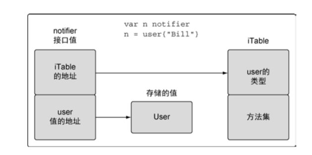
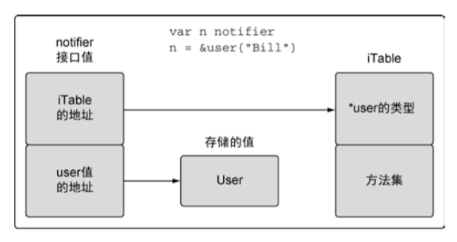

# Chapter5

## 用户定义类型
当用户声明一个新类型时，这个声明就给编译器提供了一个框架，告知必要的内存大小和表示信息。
声明后的类型与内置类型的运作方式类似。
### struct
结构类型通过组合一系列固定且唯一的字段来声明。结构里每个字段都会用一个已知类型声明。
这个已知类型可以是内置类型，也可以是其他用户定义的类型。

go 语言中声明一个变量时，这个变量对应的值总是会被初始化。这个值要么用指定的值初始化，要么用零值(即变量类型的默认值)做初始化。

```go
type user struct {
	name       string
	email      string
	ext        int
	privileged bool
}

var bill user
wzz := user{
    name:"wzz",
    email:"wzhizhao@gmail.com",
    ext:123,
    privileged:true,
}
lisa := user{"Lisa", "lisa@email.com", 123, true} //这种形式下，值的顺序很重要，必须要和结构声明中字段的顺序一致
```

### 基于已有类型
基于一个已有的类型，将其作为新类型的类型说明。当需要一个可以用已有类型表示的新类型的时候，这种方法会非常好用。
```go
type duration int64
var dur Duration
dur = int64(1000) // 会导致编译错误，因为类型不同，编译器不会对不同类型的值做隐式转换
```

## 方法
方法能给用户定义的类型添加新的行为。方法实际上也是函数，只是在声明时，在关键字 func 和方法名之间增加了一个参数。
关键字 func 和函数名之间的参数被称作接收者，将函数与接收者的类型绑在一起。如果一个函数有接收者，这个函数就被称为方法。

```go
type user struct {
	name       string
	email      string
	ext        int
	privileged bool
}

func (u user) notify() {
	fmt.Printf("Send User Email To %s<%s>",
		u.name,
		u.email)
}
```

### 接收者
Go 语言里有两种类型的接收者:值接收者和指针接收者。
值接收者使用值的副本来调用方法，而指针接受者使用实际值来调用方法。
```go
// 值接收者
func (u user) notify() {
	fmt.Printf("Send User Email To %s<%s>",
		u.name,
		u.email)
}

// 指针接收者
func (u *user) changeEmail(email string) {
	u.email = email
}
```

Go 语言既允许使用值，也允许使用指针来调用方法，不必严格符合接收者的类型。

## 类型的本质
在声明一个新类型之后，声明一个该类型的方法之前，需要先回答一个问题:这个类型的本质是什么。
如果给这个类型增加或者删除某个值，是要创建一个新值，还是要更改当前的值？
如果是要创建一个新值，该类型的方法就使用值接收者。如果是要修改当前值，就使用指针接收者。
这个答案也会影响程序内部传递这个类型的值的方式:是按值做传递，还是按指针做传递。
保持传递的一致性很重要。这个背后的原则是，不要只关注某个方法是如何处理这个值，而是要关注这个值的本质是什么。

### 内置类型
内置类型本质上是原始的类型。因此，当对这些值进行增加或者删除的时候，会创建一个新值。
基于这个结论，当把这些类型的值传递给方法或者函数时，应该传递一个对应值的副本。

### 引用类型
Go 语言里的引用类型有如下几个:切片、映射、通道、接口和函数类型。
当声明上述类型的变量时，创建的变量被称作标头(header)值。
从技术细节上说，字符串也是一种引用类型。
每个引用类型创建的标头值是包含一个指向底层数据结构的指针。
每个引用类型还包含一组独特的字段，用于管理底层数据结构。
因为标头值是为复制而设计的，所以永远不需要共享一个引用类型的值。
标头值里包含一个指针，因此通过复制来传递一个引用类型的值的副本，本质上就是在共享底层数据结构。

### 结构类型
结构类型可以用来描述一组数据值，这组值的本质即可以是原始的，也可以是非原始的。
如果决定在某些东西需要删除或者添加某个结构类型的值时该结构类型的值不应该被更改，那么需要遵守之前提到的内置类型和引用类型的规范。

当对一个类型的值做增加或者删除的操作应该更改值本身。当需要修改值本身时，在程序中其他地方，需要使用指针来共享这个值。

如果一个创建用的工厂函数返回了一个指针，就表示这个被返回的值的本质是非原始的。
即便函数或者方法没有直接改变非原始的值的状态，依旧应该使用共享的方式传递。

**是使用值接收者还是指针接收者，不应该由该方法是否修改了接收到的值来决定。这个决策应该基于该类型的本质。**

**非原始类型都应该被共享，应该使用指针接收者。原始类型的值不应该被更改，应该使用值接收者**

这条规则的一个例外是，需要让类型值符合某个接口的时候，即便类型的本质是非原始本质的，也可以选择使用值接收者声明方法。
这样做完全符合接口值调用方法的机制。

### 接口
多态是指代码可以根据类型的具体实现采取不同行为的能力。
接口是声明了一组行为并支持多态的类型。

如果一个类型实现了某个接口，所有使用这个接口的地方，都可以支持这种类型的值。

接口是用来定义行为的类型。这些被定义的行为不由接口直接实现，而是通过方法由用户定义的类型实现。
如果用户定义的类型实现了某个接口类型声明的一组方法，那么这个用户定义的类型的值就可以赋给这个接口类型的值。
这个赋值会把用户定义的类型的值存入接口类型的值。

对接口值方法的调用会执行接口值里存储的用户定义的类型的值对应的方法。
因为任何用户定义的类型都可以实现任何接口，所以对接口值方法的调用自然就是一种多态。
在这个关系里，用户定义的类型通常叫作实体类型，原因是如果离开内部存储的用户定义的类型的值的实现，接口值并没有具体的行为。

值赋值给接口变量后内部结构如下图：



在 user 类型值赋值后接口变量的值的内部布局。接口值是一个两个字长度的数据结构，
第一个字包含一个指向内部表的指针。这个内部表叫作 iTable，包含了所存储的值的类型信息。
iTable 包含了已存储的值的类型信息以及与这个值相关联的一组方法。
第二个字是一个指向所存储值的指针。将类型信息和指针组合在一起，就将这两个值组成了一种特殊的关系。

指针赋值给接口变量后内部结构如下图：



在这种情况里，类型信息会存储一个指向保存的类型的指针，而接口值第二个字依旧保存指向实体值的指针。

#### 方法集
方法集定义了接口的接受规则。

方法集定义了一组关联到给定类型的值或者指针的方法。定义方法时使用的接收者的类型决定了这个方法是关联到值，还是关联到指针，还是两个都关联。

**T 类型的值的方法集只包含值接收者声明的方法。而指向 T 类型的指针的方法集既包含值接收者声明的方法，也包含指针接收者声明的方法。**
如果使用指针接收者来实现一个接口，那么只有指向那个类型的指针才能够实现对应的接口。
如果使用值接收者来实现一个接口，那么那个类型的值和指针都能够实现对应的接口。

**因为不是总能获取一个值的地址，所以值的方法集只包括了使用值接收者实现的方法。**

## 嵌入类型
Go 语言允许用户扩展或者修改已有类型的行为。这个功能对代码复用很重要，在修改已有类型以符合新类型的时候也很重要。
这个功能是通过嵌入类型(type embedding)完成的。嵌入类型是将已有的类型直接声明在新的结构类型里。
被嵌入的类型被称为新的外部类型的内部类型。

通过嵌入类型，与内部类型相关的标识符会提升到外部类型上。这些被提升的标识符就像直接声明在外部类型里的标识符一样，也是外部类型的一部分。
这样外部类型就组合了内部类型包含的所有属性，并且可以添加新的字段和方法。
外部类型也可以通过声明与内部类型标识符同名的标识符来覆盖内部标识符的字段或者方法。
这就是扩展或者修改已有类型的方法。

嵌入类型提供了扩展类型的能力，而无需使用继承。

```go
type user struct {
	name       string
	email      string
	ext        int
	privileged bool
}

func (u user) notify() {
	fmt.Printf("Send User Email To %s<%s>",
		u.name,
		u.email)
}

type admin struct {
    user
    level string
}

ad := admin {
    user: user {
        name:"wzz",
        email:"wzhizhao@gmail.com",
        ext:123,
        privileged:true,
    },
    level: "super",
}

ad.user.notify() // 我们可以直接访问内部类型的方法
ad.notify() // 内部类型的方法也被提升到外部类型
```

对外部类型来说，内部类型总是存在的。这就意味着，虽然没有指定内部类型对应的字段名，还是可以使用内部类型的类型名，来访问到内部类型的值。

如果外部类型实现了与内部类型相同的方法，内部类型的实现就不会被提升。
不过内部类型的值一直存在，因此还可以通过直接访问内部类型的值，来调用没有被提升的内部类型实现的方法。

## 公开或未公开标识符
Go 语言支持从包里公开或者隐藏标识符。通过这个功能，让用户能按照自己的规则控制标识符的可见性。

当一个标识符的名字以小写字母开头时，这个标识符就是未公开的，即包外的代码不可见。
如果一个标识符以大写字母开头，这个标识符就是公开的，即被包外的代码可见。

即便内部类型是未公开的，内部类型里声明的字段依旧是公开的。既然内部类型的标识符提升到了外部类型，这些公开的字段也可以通过外部类型的字段的值来访问。

第一，公开或者未公开的标识符，不是一个值。

第二， 短变量声明操作符，有能力捕获引用的类型，并创建一个未公开的类型的变量。

永远不能显式创 建一个未公开的类型的变量，不过短变量声明操作符可以这么做。

```go
package user

type user struct {
	email string
	Name string
}

func New(email string, name string) *user {
	return &user{email:email, Name:name}
}
```
```go
package main

import (
	"fmt"

	"learn-go/user"
)

func main() {
    user := user.NewUser("wzhizhao@gmail.com", "wangzhizhao")
        fmt.Println(user)
        fmt.Println(user.email) // 会导致编译错误，因为 email 是未公开变量
        fmt.Println(user.Name)
    }
}
```