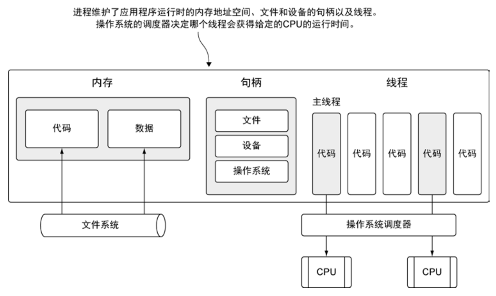
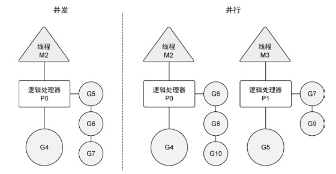
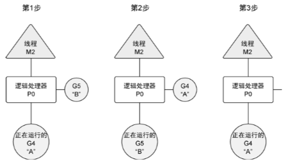
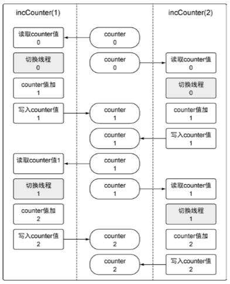

# Chapter6

### Introduction
Go 语言运行时的调度器是一个复杂的软件，能管理被创建的所有 goroutine 并为其分配执行时间。
这个调度器在操作系统之上，将操作系统的线程与语言运行时的逻辑处理器绑定，并在逻辑处理器上运行 goroutine。
调度器在任何给定的时间，都会全面控制哪个 goroutine 要在哪个逻辑处理器上运行。

Go 语言的并发同步模型来自一个叫作通信顺序进程(Communicating Sequential Processes，CSP)的范型(paradigm)。
CSP 是一种消息传递模型，通过在 goroutine 之间传递数据来传递消息，而不是对数据进行加锁来实现同步访问。
用于在 goroutine 之间同步和传递数据的关键数据类型叫作通道(channel)。

### 并发与并行
#### 进程与线程


- 进程是资源分配的基本单位
- 线程是系统调度的基本单位

操作系统会在物理处理器上调度线程来运行，而 Go 语言的运行时会在逻辑处理器上调度 goroutine 来运行。
每个逻辑处理器都分别绑定到单个操作系统线程。

Go语言的运行时默认会为每个可用的物理处理器分配一个逻辑处理器。

#### goroutine 并发模型


**如果创建一 个 goroutine 并准备运行，这个 goroutine 就会被放到调度器的全局运行队列中。
之后，调度器就将这些队列中的 goroutine 分配给一个逻辑处理器，并放到这个逻辑处理器对应的本地运行队列中。
本地运行队列中的 goroutine 会一直等待直到自己被分配的逻辑处理器执行。**

有时，正在运行的 goroutine 需要执行一个阻塞的系统调用，如打开一个文件。
当这类调用发生时，线程和 goroutine 会从逻辑处理器上分离，该线程会继续阻塞，等待系统调用的返回。
与此同时，这个逻辑处理器就失去了用来运行的线程。所以，调度器会创建一个新线程，并将其绑定到该逻辑处理器上。
之后，调度器会从本地运行队列里选择另一个 goroutine 来运行。一旦被阻塞的系统调用执行完成并返回，对应的 goroutine 会放回到本地运行队列，
而之前的线程会保存好，以便之后可以继续使用。

如果一个 goroutine 需要做一个网络 I/O 调用，流程上会有些不一样。在这种情况下，goroutine 会和逻辑处理器分离，并移到集成了网络轮询器的运行时。
一旦该轮询器指示某个网络读或者写操作已经就绪，对应的 goroutine 就会重新分配到逻辑处理器上来完成操作。
调度器对可以创建的逻辑处理器的数量没有限制，但语言运行时默认限制每个程序最多创建 10 000 个线程。
这个限制值可以通过调用 runtime/debug 包的 SetMaxThreads 方法来更改。如果程序试图使用更多的线程，就会崩溃。


并发(concurrency)不是并行(parallelism)。并行是让不同的代码片段同时在不同的物理处理器上执行。
并行的关键是同时做很多事情，而并发是指同时管理很多事情，这些事情可能只做了一半就被暂停去做别的事情了。
在很多情况下，并发的效果比并行好，因为操作系统和硬件的总资源一般很少，但能支持系统同时做很多事情。
这种“使用较少的资源做更多的事情”的哲学， 也是指导 Go 语言设计的哲学。

如果希望让 goroutine 并行，必须使用多于一个逻辑处理器。当有多个逻辑处理器时，调度器会将 goroutine 平等分配到每个逻辑处理器上。
这会让 goroutine 在不同的线程上运行。不过要想真的实现并行的效果，用户需要让自己的程序运行在有多个物理处理器的机器上。
否则，哪怕 Go 语言运行时使用多个线程，goroutine 依然会在同一个物理处理器上并发运行，达不到并行的效果。



## goroutine
基于调度器的内部算法，一个正运行的 goroutine 在工作结束前，可以被停止并重新调度。
调度器这样做的目的是防止某个 goroutine 长时间占用逻辑处理器。
当 goroutine 占用时间过长时，调度器会停止当前正运行的 goroutine，并给其他可运行的 goroutine 运行的机会。



### 修改逻辑处理器数量
```go
import "runtime"

runtime.GOMAXPROCS(runtime.NumCPU()) // 给每个可用的核心分配一个逻辑处理器
```

**只有在有多个逻辑处理器且可以同时让每个 goroutine 运行在一个可用的物理处理器上的时候，goroutine 才会并行运行。**

## 竞争状态
如果两个或者多个 goroutine 在没有互相同步的情况下，访问某个共享的资源，并试图同时读和写这个资源，
就处于相互竞争的状态，这种情况被称作竞争状态(race candition)。

对一个共享资源的读和写操作必须是`原子化`的，换句话说，同一时刻只能有一个 goroutine 对共享资源进行读和写操作。

**go 竞争检测工具**
```bash
go build -race # 用竞争检测器标志来编译程序
```

例如
``` bash
go build -race chapter6/sample/goroutinerace.go

./goroutinerace

# 输出内容如下
==================
WARNING: DATA RACE
Read at 0x0000011d6318 by goroutine 7:

==================
Final counter:  4
Found 1 data race(s)
```

chapter6/sample/goroutinerace.go 竞争行为图像表达：



## 锁住共享资源

### atomic
原子函数能够以很底层的加锁机制来同步访问整型变量和指针。

示例 `chapter6/sample/goroutineatom.go` 中使用了 atmoic 包的 AddInt64 函数，
该函数会同步整型值的加法，方法是强制同一时刻只能有一个 goroutine 运行并完成这个加法操作。
当 goroutine 试图去调用任何原子函数时，这些 goroutine 都会自动根据所引用的变量做同步处理。

另外两个有用的原子函数是 LoadInt64 和 StoreInt64。这两个函数提供了一种安全地读和写一个整型值的方式。
见示例：`chapter6/sample/goroutineatom2.go`

### mutex lock
互斥锁用于在代码上创建一个临界区，保证同一时间只有一个 goroutine 可以执行这个临界区代码。
示例：`chapter6/sample/goroutinemutex.go` 中 Lock() 和 Unlock() 函数调用定义的临界 区里被保护起来。

## channel 通道
当一个资源需要在 goroutine 之间共享时，通道在 goroutine 之间架起了一个管道，并提供了确保同步交换数据的机制。
声明通道时，需要指定将要被共享的数据的类型。可以通过通道共享内置类型、命名类型、结构类型和引用类型的值或者指针。

### 使用 make 创建通道
```go
// 无缓冲的整型通道
unbuffered := make(chan int)

// 有缓冲的字符串通道
buffered := make(chan string, 10)
```

### 无缓冲通道
示例：`chapter6/sample/unbufferedchannel.go`

无缓冲的通道(unbuffered channel)是指在接收前没有能力保存任何值的通道。
这种类型的通道要求发送 goroutine 和接收 goroutine 同时准备好，才能完成发送和接收操作。
如果两个 goroutine 没有同时准备好，通道会导致先执行发送或接收操作的 goroutine 阻塞等待。
这种对通道进行发送和接收的交互行为本身就是同步的。其中任意一个操作都无法离开另一个操作单独存在。

### 有缓冲的通道
示例：`chapter6/sample/bufferedchannel.go`

有缓冲的通道(buffered channel)是一种在被接收前能存储一个或者多个值的通道。
这种类型的通道并不强制要求 goroutine 之间必须同时完成发送和接收。
通道会阻塞发送和接收动作的条件也会不同。只有在通道中没有要接收的值时，接收动作才会阻塞。
只有在通道没有可用缓冲区容纳被发送的值时，发送动作才会阻塞。
这导致有缓冲的通道和无缓冲的通道之间的一个很大的不同:
**无缓冲的通道保证进行发送和接收的 goroutine 会在同一时间进行数据交换;有缓冲的通道没有这种保证。**

**无缓冲的通道保证同时交换数据，而有缓冲的通道不做这种保证。**

### 关闭通道
当通道关闭后，goroutine 依旧可以从通道接收数据，但是不能再向通道里发送数据。
能够从已经关闭的通道接收数据这一点非常重要，因为这允许通道关闭后依旧能取出其中缓冲的全部值，而不会有数据丢失。
从一个已经关闭且没有数据的通道里获取数据，总会立刻返回，并返回一个通道类型的零值。
如果在获取通道时还加入了可选的标志，就能得到通道的状态信息。